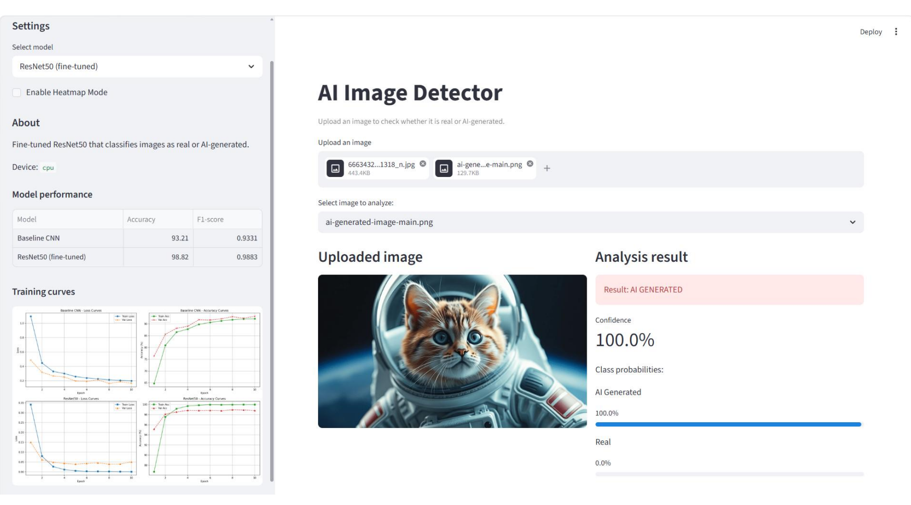
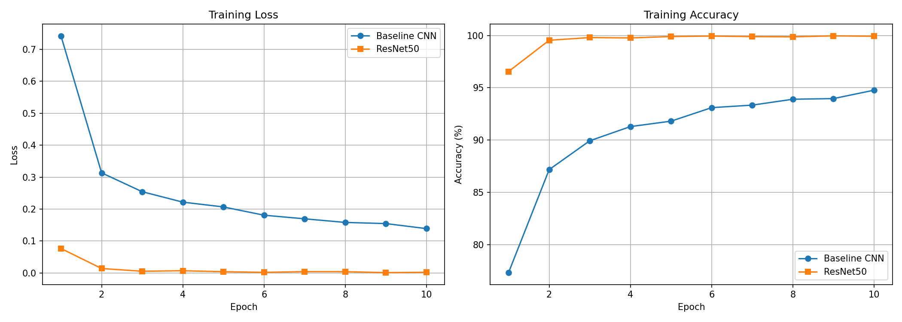

# AI Image Detector

This project classifies images into two classes:
- REAL
- AI GENERATED

Training and inference are implemented in PyTorch, and the user interface is built with Streamlit.



## What This Project Does

1. Trains two models:
   - A custom Baseline CNN trained from scratch.
   - A fine-tuned ResNet50 model using transfer learning.
2. Evaluates both models using Accuracy and F1-score.
3. Saves model checkpoints, metrics, and training plots.
4. Runs a web app where users can upload images and receive predictions with confidence scores.
5. Supports optional heatmap mode using patch-based analysis to visualize which regions of an image are detected as AI-generated.

## Tech Stack

- Python
- torch, torchvision
- scikit-learn
- matplotlib, pandas
- streamlit
- Pillow

## Dataset

The default training dataset is the **Parveshi AI-vs-Real** dataset:

```
https://huggingface.co/datasets/Parveshiiii/AI-vs-Real
```

Expected directory structure:

```text
data/
    train/
        fake/
        real/
    test/
        fake/
        real/
```

Supported image extensions: `.jpg`, `.jpeg`, `.png`, `.bmp`, `.gif`, `.tiff`, `.tif`, `.webp`, `.ico`, `.ppm`, `.pgm`, `.pbm`

### Additional datasets used for cross-dataset evaluation:

| Dataset | Source |
|---|---|
| LuckyCow | https://huggingface.co/datasets/LuckyCow/Ai_vs_real_web_images |
| NanoBanana | https://huggingface.co/datasets/julienlucas/midjourney-dalle-sd-nanobananapro-dataset |
| Kaggle1 | https://www.kaggle.com/datasets/tristanzhang32/ai-generated-images-vs-real-images |
| Kaggle2 | https://huggingface.co/datasets/Hemg/AI-Generated-vs-Real-Images-Datasets |
| Kaggle3 | https://www.kaggle.com/datasets/rhythmghai/ai-vs-real-images-dataset |

Using multiple datasets allowed cross-dataset evaluation to test model generalization and robustness against different AI generation styles.

## Results

Current model performance trained on the Parveshi dataset (224x224, 10 epochs, batch size 256):

| Model | Accuracy | F1-score |
|---|---|---|
| Baseline CNN | 94.39% | 0.9428 |
| ResNet50 (fine-tuned) | 99.00% | 0.9899 |

### Cross-Dataset Generalization (ResNet50 trained on Parveshi only)

| Dataset | Accuracy |
|---|---|
| Parveshi (in-domain) | 98.67% |
| NanoBanana | 67.37% |
| Combined | 70.27% |
| LuckyCow | 56.23% |
| Kaggle2 | 67.23% |
| Kaggle1 | 47.27% |

The drop in accuracy on external datasets is a known domain overfitting issue. It can be significantly reduced by training on a Combined multi-dataset.



## Setup

1. Clone the repository and enter the project directory.
2. Create and activate a virtual environment.
3. Install dependencies.

```bash
git clone https://github.com/Blazejoida/ai-image-detector.git
cd ai-image-detector
```

Windows (PowerShell):

```powershell
python -m venv venv
.\venv\Scripts\Activate.ps1
pip install -r requirements.txt
```

Linux/Mac:

```bash
python -m venv venv
source venv/bin/activate
pip install -r requirements.txt
```

## Train the Models

```bash
python train.py
```

Training workflow:

1. Create train and test loaders via `get_loaders()`.
2. Train Baseline CNN for `EPOCHS_BASELINE` epochs.
3. Evaluate Baseline CNN on the test loader.
4. Train ResNet50 (fine-tuned) for `EPOCHS_FINETUNE` epochs.
5. Evaluate ResNet50 on the test loader.
6. Save checkpoints, metrics table, and plots to `model/`.

## Train/Test Split Logic

The loader logic is implemented in `model/dataset.py`.

1. If both test class folders contain valid images:
   - Training data is loaded from `data/train`.
   - Test data is loaded from `data/test`.

2. If `data/test` is empty or incomplete:
   - Training does not stop.
   - A fallback split is created from `data/train`.
   - Default fallback ratio is 80 percent train and 20 percent test.
   - The split is reproducible with seed 42.


## Baseline CNN vs ResNet50

| Aspect | Baseline CNN | ResNet50 |
|---|---|---|
| Model type | Custom small CNN | Deep residual network |
| Initialization | Random weights | ImageNet pretrained weights |
| Training strategy | Train from scratch | Transfer learning + fine-tuning |
| Capacity | Lower | Higher |
| Speed and compute | Faster, lighter | Slower, heavier |
| Typical performance | Good baseline reference | Superior accuracy and F1 |
| Role in this project | Reference benchmark model | Main production model |

## Run the Web App

```bash
streamlit run app.py
```

The app features:

1. **Model selection**: Switch between ResNet50 (fine-tuned) and Baseline CNN from the sidebar.
2. **Multiple image upload**: Upload multiple images at once and select which one to analyze.
3. **Standard analysis**: Displays predicted class, confidence percentage, and per-class probability bars.
4. **Heatmap mode**: Patch-based tile analysis that overlays a red heatmap on image regions detected as AI-generated.
5. **Model performance table**: Shows Accuracy and F1-score for both models (loaded from `model/results.csv`).
6. **Training curves**: Displays the training loss and accuracy plot from `model/training_curves.png`.

Note: the web app will show an error if model weights are not present. Run `python train.py` first to generate them.

## Training Outputs

After running `train.py`, the following files are saved:

- `model/baseline.pth` - Baseline CNN checkpoint
- `model/model.pth` - ResNet50 checkpoint (used by the app)
- `model/results.csv` - Final Accuracy and F1-score for both models
- `model/training_curves.png` - Loss and accuracy training curves
- `model/resnet_confusion_matrix.png` - ResNet50 confusion matrix
- `model/baseline_confusion_matrix.png` - Baseline CNN confusion matrix

## Project File Purposes

- `app.py` - Streamlit UI entry point. Loads trained models, preprocesses uploaded images, runs inference, and displays prediction results.
- `train.py` - Main training script. Builds loaders, trains both models, evaluates them, and saves all artifacts.
- `config.py` - Central configuration file. Stores device selection, paths, hyperparameters, class labels, and supported file extensions.
- `requirements.txt` - Python dependencies for training and running the app.
- `model/architectures.py` - Defines model architectures: BaselineCNN and ResNet50 with optional backbone freezing.
- `model/dataset.py` - Creates transforms and data loaders. Handles test-folder availability and fallback train/test split logic.
- `model/trainer.py` - Contains training and evaluation loops, loss/accuracy tracking, and sklearn-based metrics.
- `model/reporting.py` - Saves summary metrics to CSV and training curves to an image file.

## Important Configuration

Edit `config.py` to adjust key parameters:

| Parameter | Default | Description |
|---|---|---|
| `DEVICE` | auto | Selects `cuda` if available, otherwise `cpu` |
| `DATA_DIR` | `/mnt/j/biai/data_parveshi_224` | Root path to the dataset |
| `MODEL_DIR` | `model` | Directory for saved checkpoints |
| `BATCH_SIZE` | 256 | Images per training batch |
| `EPOCHS_BASELINE` | 10 | Training epochs for Baseline CNN |
| `EPOCHS_FINETUNE` | 10 | Training epochs for ResNet50 |
| `LR_BASELINE` | 0.001 | Learning rate for Baseline CNN |
| `LR_FINETUNE` | 0.0001 | Learning rate for ResNet50 |
| `IMAGE_SIZE` | (224, 224) | Input image size for preprocessing |
| `CLASSES` | `["AI GENERATED", "REAL"]` | Output class labels |

## Model Weights

The `.pth` checkpoint files contain trained model weights and are excluded from Git tracking via `.gitignore`.

To share or distribute model weights, use one of the following:
- GitHub Releases
- Google Drive or OneDrive

## Common Issues

1. **Model not found error in the app:**
   - Run `python train.py` first to generate `model/model.pth`.

2. **Dataset not found:**
   - Verify the `DATA_DIR` path in `config.py` points to a directory with `train/fake/` and `train/real/` subfolders.
   - Verify images use supported extensions.

3. **Low accuracy on external datasets:**
   - This is expected when training only on Parveshi.
   - Use a Combined multi-dataset for better generalization.

## Authors

- Błażej Jamrozik: [GitHub Profile](https://github.com/Blazejoida)
- Bartosz Kępa: [GitHub Profile](https://github.com/Dedeusz04)

## Supervisor

Anna Daniłowicz, MSc Eng. - Silesian University of Technology, Department of Computer Graphics, Vision and Digital Systems
